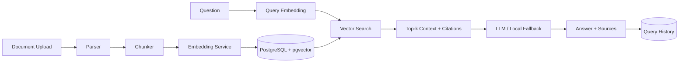

# DocMind RAG

Production-oriented document question-answering backend built with **FastAPI, PostgreSQL + pgvector, Docker, embeddings and retrieval-augmented generation (RAG)**.

DocMind ingests PDF, TXT and Markdown documents, chunks and embeds their text, stores vectors in PostgreSQL, retrieves the most relevant passages for a question, and produces answers with explicit source citations.

## Features

- Async FastAPI REST API
- PDF / TXT / Markdown ingestion
- SHA-256 document fingerprinting
- Configurable text chunking with overlap
- OpenAI embeddings when an API key is available
- Deterministic local embedding fallback for offline/demo use
- PostgreSQL + pgvector vector search
- RAG answer generation with source citations
- Prompt-injection-aware system instruction: retrieved text is treated as untrusted context
- Query history persisted in PostgreSQL
- Alembic migrations
- Docker + Docker Compose
- Pytest + GitHub Actions CI

## Architecture



## Quick start

```bash
cp .env.example .env
docker compose up --build
```

The API will be available at:

- Swagger UI: `http://localhost:8010/docs`
- Health check: `http://localhost:8010/health`

The Compose stack automatically runs Alembic migrations before starting the API.

## API flow

### 1. Upload a document

```bash
curl -X POST http://localhost:8010/api/v1/documents \
  -F "file=@example.pdf"
```

### 2. Ask a question

```bash
curl -X POST http://localhost:8010/api/v1/query \
  -H "Content-Type: application/json" \
  -d '{"question":"What are the key conclusions?","top_k":5}'
```

### 3. Inspect query history

```bash
curl http://localhost:8010/api/v1/queries
```

## Offline vs. LLM mode

Without `OPENAI_API_KEY`, the project remains fully runnable:

- embeddings use a deterministic hash-based local vectorizer
- answers return the most relevant cited excerpts

With an OpenAI API key:

- document/query embeddings use `text-embedding-3-small` with a configured reduced dimension
- answer generation uses the configured chat model

This makes the repository easy to run locally while still demonstrating a real external-LLM integration path.

## Tech stack

`Python` · `FastAPI` · `SQLAlchemy` · `PostgreSQL` · `pgvector` · `Alembic` · `Docker` · `OpenAI API` · `PyPDF` · `pytest` · `GitHub Actions`

## Engineering choices

- Vector dimension is fixed across local and OpenAI embedding modes so the same pgvector column works in both.
- Retrieved chunks carry stable citation identifiers such as `[D2:C14]`.
- The generation prompt explicitly tells the model not to follow instructions contained inside retrieved documents.
- Uploaded source files are processed in memory; only metadata, extracted chunks and vectors are persisted by default.
